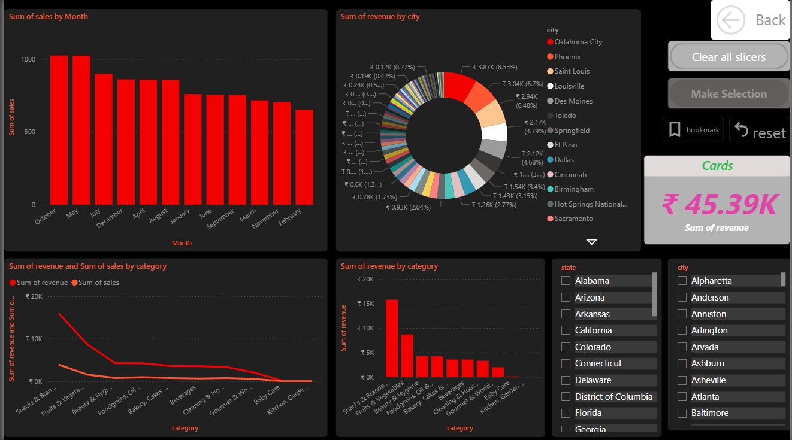
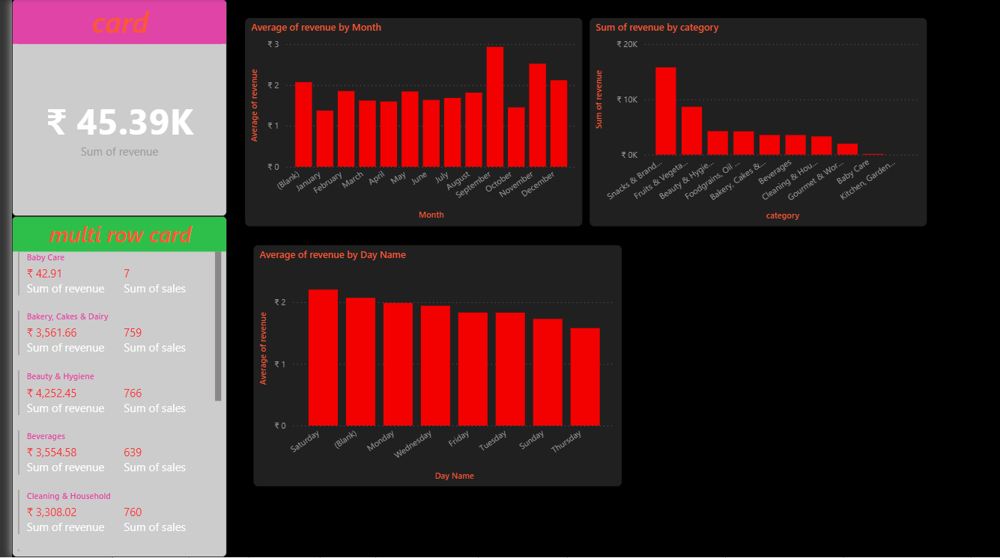

# 📊 Sales Insights Dashboard (Power BI)

## 📌 Overview
This project is an interactive Power BI dashboard designed to analyze sales performance across regions, categories, and time periods. It helps in understanding business trends and supports data-driven decision-making.

---

## 🚀 Features
- 📈 KPI tracking (Total Sales, Profit, Customer Count)
- 🎯 Interactive filters and slicers (Region, Category, Time)
- 📅 Time-series analysis (Monthly & Quarterly trends)
- 📊 Multi-page dashboard for detailed insights

---

## 🛠 Tools & Technologies
- Power BI  
- DAX (Data Analysis Expressions)  
- Power Query  
- Data Modeling  

---

## 📷 Dashboard Preview
<!-- Add your screenshots here -->

---

## 📈 Key Insights
- Identified top-performing products and regions  
- Analyzed seasonal sales trends and revenue patterns  
- Improved understanding of customer purchasing behavior  
- Enabled better business decision-making through data visualization  

---

## 📂 Project Files
- `dashboard2.pbix` – Power BI dashboard file  

---

## 🔗 Project Link
Add your GitHub repo link here  

---

## 🙋‍♂️ Author
**Hareesh Kakedu**  
- 📧 hareeshkakedu@gmail.com  
- 🔗 LinkedIn: https://linkedin.com/in/hareesh-kakedu-abb507303/  
- 💻 GitHub: https://github.com/hareesh-13  

---